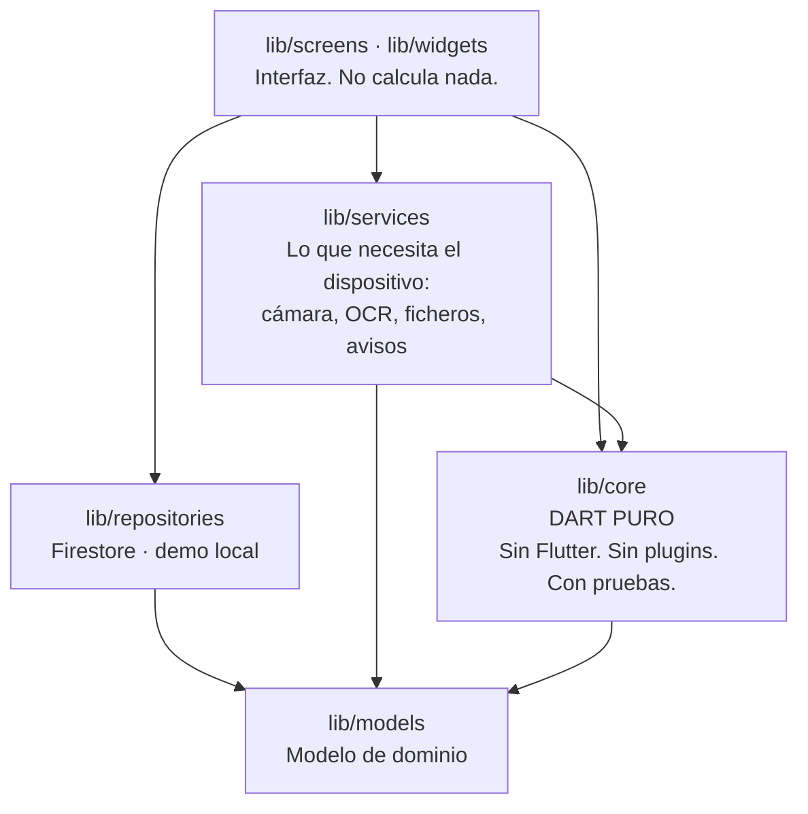
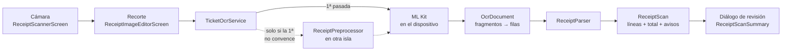
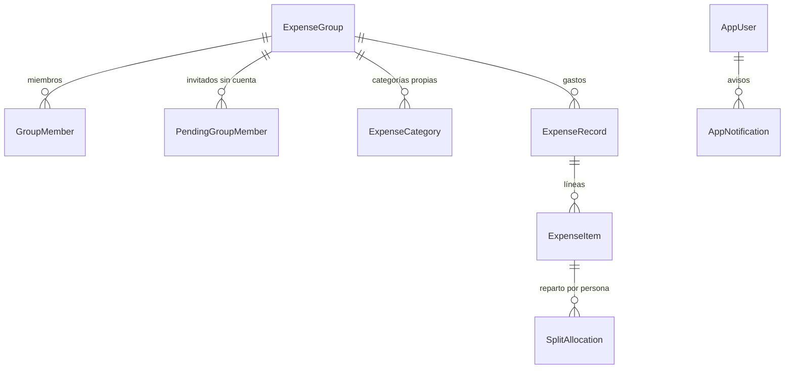

# Arquitectura de ShardPay

Este documento explica cómo está montada la app y, sobre todo, **por qué**. Las
decisiones con alternativas descartadas viven en [`adr/`](adr/); aquí está el
mapa.

## En una frase

Una app Flutter con un **núcleo de Dart puro sin dependencias** donde vive toda
la lógica de negocio, una capa de repositorio que habla con Firestore, y una capa
de interfaz que no calcula nada.

## Capas

La regla que sostiene todo esto:

> **`lib/core/` no importa Flutter, ni `dart:ui`, ni ningún plugin.**

De ahí sale la propiedad que más se nota en el día a día: ese núcleo se compila y
se prueba con `dart test` a secas, sin emulador, sin dispositivo y sin SDK de
Flutter. Las pruebas del núcleo corren en menos de un segundo.

Y es también lo que deja abierta la puerta de la portabilidad: si algún día se
migra a Kotlin Multiplatform (véase [ADR-0001](adr/0001-stack-y-portabilidad.md)),
lo único que habría que traducir es `lib/core/`.

## El núcleo, pieza a pieza

### `lib/core/receipts/` — lectura de tickets

Cuatro ficheros, ninguno de los cuales sabe que existe ML Kit:

| Fichero | Responsabilidad |
| --- | --- |
| `ocr_document.dart` | Agrupa los fragmentos sueltos del OCR en filas, y mide la geometría de la página |
| `money_scanner.dart` | Encuentra los importes dentro de una línea y los interpreta |
| `receipt_lexicon.dart` | Vocabulario multiidioma para clasificar líneas |
| `receipt_parser.dart` | Junta todo lo anterior y produce un `ReceiptScan` |

El flujo completo:

Dos decisiones de diseño que explican el resto:

**Se trabaja con palabras, no con líneas.** ML Kit une en la misma «línea» el
nombre del artículo y su precio aunque estén en extremos opuestos del papel. Si
se toma esa línea tal cual, se pierde la posición horizontal del importe — que es
justo la señal más fiable que hay en un ticket: los precios van alineados en una
columna a la derecha. Por eso se toman los **elementos** (palabras) con su caja y
se reagrupan por solape vertical.

**Se agrupa por solape, no por distancia.** Los tickets se fotografían torcidos.
Con cinco grados de inclinación, el extremo derecho de un renglón queda más bajo
que el centro del siguiente, y cualquier umbral por distancia entre centros los
mezcla.

**Se cuadra contra el total impreso.** Es lo que más se nota en una app de
repartir gastos: da igual que el OCR se deje un producto si el reparto acaba
sumando lo que de verdad se pagó. Si la suma de las líneas no llega al total, se
añade una línea de ajuste y se avisa; si se pasa, se busca la línea duplicada.

### `lib/core/expense_math.dart` — saldos y liquidaciones

El corazón del cálculo. La pieza importante es `GroupLedger`, un **índice que se
calcula una vez por instancia de grupo**:

- Identificadores canónicos memoizados (los invitados pendientes llevan el
  prefijo `pending:` y aparecen escritos de dos formas por arrastre histórico).
- Saldo neto de cada miembro.
- Matriz de deudas entre pares, antisimétrica.

Se guarda en un `Expando` sobre la instancia de `ExpenseGroup`. Eso tiene una
propiedad muy cómoda: **la caché se invalida sola**. Cada instantánea de
Firestore construye un `ExpenseGroup` nuevo, así que el índice viejo desaparece
con él y no hay que acordarse de limpiar nada.

Lo que se ganó, medido sobre grupos sintéticos:

| Escenario | Antes | Ahora (frío) | Ahora (mismo fotograma) |
| --- | --- | --- | --- |
| 6 personas, 100 gastos | 3,2 ms | 1,9 ms | < 0,1 ms |
| 10 personas, 400 gastos | 29,3 ms | 3,6 ms | < 0,1 ms |
| 15 personas, 1000 gastos | **197 ms** | **13,5 ms** | < 0,1 ms |

197 ms son doce fotogramas perdidos en cada reconstrucción de la pantalla. El
motivo era doble: `canonicalGroupUserId` reconstruía la lista de miembros
visibles en cada llamada, dentro del bucle más interno; y
`groupBalanceSummaries` recorría todos los gastos **una vez por miembro**.

Los resultados son idénticos al céntimo: hay una prueba que lo comprueba contra
la implementación anterior.

### `lib/core/backup_format.dart` — copias de seguridad

Estructura, validación y suma de verificación del fichero `.shardpay.bak`. El
gzip y el disco quedan fuera, en `lib/services/backup_service.dart`, para que el
formato se pueda probar sin dispositivo. Véase
[ADR-0004](adr/0004-formato-de-copia-de-seguridad.md).

### `lib/core/donation_policy.dart` — cuándo aparece el aviso

Reglas puras y con pruebas: una vez al cerrar la primera sesión productiva, una
segunda oportunidad a los 30 días y 10 usos, y silencio después. Véase
[ADR-0008](adr/0008-donacion-y-politicas-de-tienda.md).

## Datos

### Modelo

Un `ExpenseRecord` puede ser un **gasto** o una **liquidación**
(`ExpenseRecordKind`). Las liquidaciones cancelan deudas abiertas en orden
cronológico.

El reparto se guarda como **porcentaje por persona y por línea**, no como
importe. Eso permite cambiar el importe de una línea sin rehacer el reparto, y
obliga a que los porcentajes de cada línea sumen 100.

### Almacenamiento

Toda la información de un grupo vive en **un solo documento de Firestore**,
gastos incluidos. Es cómodo y rápido, y tiene un techo de 1 MiB. El punto de
ruptura, lo que se ha hecho para mitigarlo y el plan para la 1.1 están en
[ADR-0005](adr/0005-modelo-de-datos-y-limite-de-firestore.md).

Optimizaciones aplicadas en el repositorio:

- **Caché de deserialización por documento y versión.** Tocar un gasto de un
  grupo ya no obliga a reconstruir todos los grupos del usuario.
- **Escrituras dirigidas.** Añadir un gasto envía `expenses` y `updatedAt`, no el
  documento entero. Además de gastar menos, deja de pisar los cambios que otro
  miembro haya hecho a los miembros o a los ajustes en el mismo instante.

### Modo de demostración

Si no hay credenciales de Firebase (`AppConfig.hasFirebaseConfiguration`), el
arranque usa `MockAppRepository`, en memoria, con datos de ejemplo. La app es
completamente navegable. Sirve para desarrollar, hacer capturas y probar la
interfaz sin tocar producción.

## Estado

Riverpod, con la convención de siempre:

- `Provider` para servicios sin estado.
- `StreamProvider.autoDispose.family` para lo que viene de Firestore.
- `StateNotifierProvider` para las preferencias.

Los proveedores están todos en `lib/app/providers.dart`. Los dos que se
sobrescriben en `main.dart` (`bootstrapProvider` y `localPreferencesStoreProvider`)
lanzan `UnimplementedError` si no se sobrescriben, que es la forma de que un
olvido falle en el arranque y no a media sesión.

## Temas e idiomas

**13 paletas**, cada una emparejada con su hermana del brillo contrario
(`counterpartId`). Eso es lo que hace posible «Seguir el sistema» sin cambiar de
estética: si eliges *Océano* y el sistema pasa a oscuro, la app se pone *Aurora*,
que es la misma idea en oscuro.

Todos los colores son tokens de `AppThemeOption`; no hay colores sueltos en las
pantallas.

El color del texto sobre cada fondo lo decide `colorOn`, que calcula la
**relación de contraste real** según WCAG y recurre al blanco o al negro puros si
ningún color del tema llega a 4,5:1. La versión anterior usaba
`ThemeData.estimateBrightnessForColor`, que va por un umbral de luminancia, y
ponía texto blanco sobre acentos claros en las trece paletas. Hay una prueba por
paleta que lo comprueba.

**14 idiomas**, incluidos los trece que exige el proyecto. El árabe implica
disposición de derecha a izquierda, que Flutter deriva de la locale a través de
`GlobalWidgetsLocalizations`, más `android:supportsRtl="true"` en el manifiesto.

El mecanismo de traducción es la función `tr()` de `lib/app/app_text.dart`: el
castellano es obligatorio en cada punto de llamada y el resto son opcionales; lo
que falte se resuelve contra catálogos indexados por el texto inglés. Es
deliberadamente distinto de un `.arb` con generación de código, y la razón es
pragmática: hay unos 470 puntos de llamada, y esta forma permitió añadir cuatro
idiomas sin tocar ninguno.

Los mensajes que produce el núcleo (avisos del parser, errores de copia) se
devuelven como **enum**, nunca como texto, y los traduce la capa de interfaz.

## Seguridad: quién puede leer un grupo

Las reglas de `firestore.rules` son la única barrera entre los gastos de un grupo
y quien no es miembro. **Un grupo lo leen sus miembros y nadie más.**

Eso no siempre fue así, y la historia importa porque explica la forma actual del
código. Hasta [ADR-0009](adr/0009-lectura-de-invitaciones.md), `allow get` y
`allow list` sobre `groups` aceptaban a cualquier usuario autenticado, para que
la vista previa de una invitación pudiera enseñar «vas a unirte a *Roadtrip
Costa*, 4 miembros». Como el documento del grupo lleva dentro todos los gastos,
lo que se exponía era el historial completo de cualquier grupo a cualquiera con
una cuenta.

Tres piezas lo cierran:

| Pieza | Qué hace |
| --- | --- |
| `invites/{codigo}` | Ficha pública con nombre, icono, divisa, número de miembros y huecos libres. Sin gastos, sin correos, sin identificadores, sin PIN. Se lee con cuenta; **no se puede enumerar** |
| `joinProof` | El móvil ya no puede leer el PIN, así que manda `sha256("<pin>:<uid>")` y la regla lo recalcula contra el valor real. Antes se comparaba en el cliente, que es tanto como no comprobarlo |
| `claimedSlots` | Reclamar el hueco de «Marta» anota `hueco → uid` y se resuelve al leer, en `GroupLedger`. Antes se reescribían **todos** los gastos del grupo al entrar, lo que exigía leerlo sin ser miembro |

Al arreglarlo apareció un segundo agujero: la regla de entrada incluía `expenses`
entre los campos modificables, así que cualquiera con un código podía vaciar el
historial del grupo en la misma escritura con la que entraba. También está
cerrado y fijado por prueba.

La ficha pública la mantiene la propia app desde `_materializeGroup`, no una
Cloud Function. Como se dispara la primera vez que un miembro abre un grupo,
sirve además de migración para los grupos anteriores al cambio, sin script
aparte y sin depender de que una función esté caliente.

Las reglas son además la primera línea de **control de gasto**: el proyecto está
en [Blaze](adr/0010-plan-blaze-y-control-de-gasto.md), donde no hay tope
automático, y una consulta sin filtro sobre `groups` se cobraría por documento
leído. Que nadie pueda barrer la colección no es solo privacidad.

**Todo esto se ejecuta contra el emulador de Firestore**, no se revisa a ojo:
`firestore-tests/rules.test.js`, 38 comprobaciones, en el job `reglas` de la CI.

## Pruebas

| Suite | Qué cubre | Dónde |
| --- | --- | --- |
| Parser de tickets | Separadores decimales, cantidades, descuentos, cuadre, geometría, regresiones | `test/core/receipts/` |
| Cálculo de saldos | Invariantes: los saldos suman cero, la matriz es antisimétrica, las liquidaciones dejan todo a cero | `test/core/expense_math_test.dart` |
| Copias de seguridad | Ida y vuelta exacta, cabecera, ficheros corruptos, versión futura, migraciones | `test/core/backup_format_test.dart` |
| Aviso de donación | Las cinco reglas de aparición | `test/core/donation_policy_test.dart` |
| Temas | **Contraste AA en las trece paletas**, emparejamiento claro/oscuro | `test/app/theme_test.dart` |
| Idiomas | Los trece exigidos, RTL, respaldos, y que `locales_config.xml` no se separe de la lista de Dart | `test/app/localization_test.dart` |
| Widgets | Se dibujan sin excepciones en las trece paletas y en árabe; accesibilidad y reducción de animaciones | `test/widgets/rendering_test.dart` |
| Modelo | Serialización | `test/models/` |

**220 pruebas sin dispositivo en unos 16 segundos, más 38 de reglas contra el emulador.** Detalle en
[`MANUAL-TECNICO.md`](MANUAL-TECNICO.md).
