# ShardPay — Manual de usuario

ShardPay lleva la cuenta de lo que paga cada persona en un grupo y calcula quién
le debe qué a quién. Puedes apuntar los gastos a mano o hacerle una foto al
ticket para que la app lea las líneas sola.

Es **gratis y completa**, no tiene anuncios y no recoge tus datos para nada que
no sea hacerla funcionar.

---

## 1. Empezar

### Crear tu cuenta

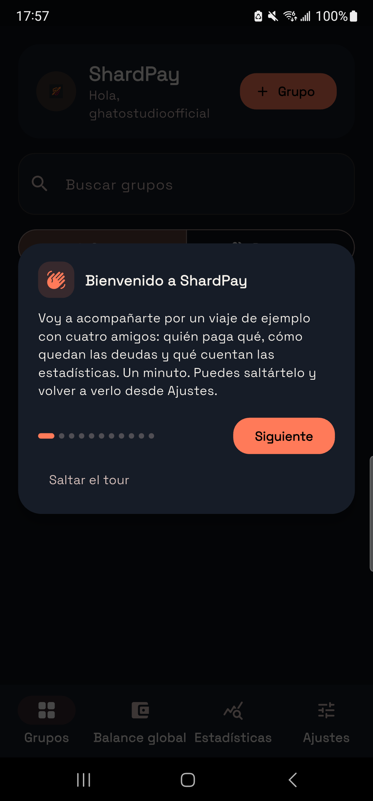

Al abrir la app por primera vez tienes dos caminos: **crear una cuenta** con tu
correo o **entrar con Google**. Da igual cuál elijas; lo importante es usar
siempre el mismo, porque es lo que hace que tus grupos aparezcan cuando cambias
de móvil.

### El tour guiado

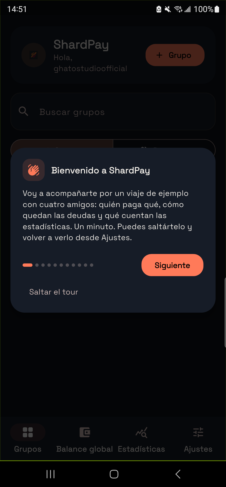
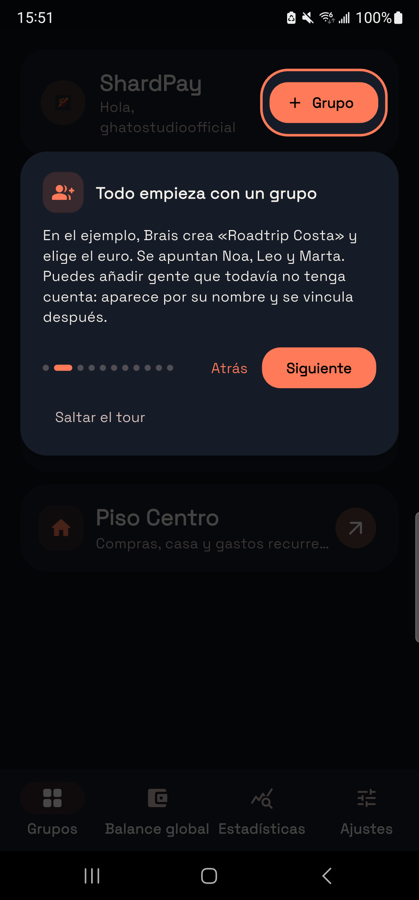

La primera vez, ShardPay te da un repaso de medio minuto señalando cada botón:
dónde se crea un grupo, dónde se entra con una invitación, dónde está el lector
de tickets y para qué sirve cada pestaña.

Puedes saltártelo con «Saltar el tour», y volver a verlo cuando quieras desde
**Ajustes → ShardPay → Ver el tour guiado**.

### Crear un grupo

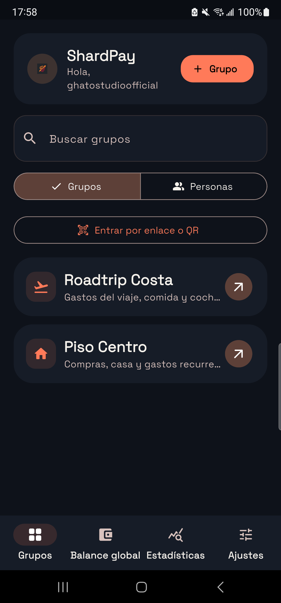

Desde la pantalla de **Grupos**, pulsa el botón de crear. Necesitas:

- Un **nombre**: «Piso», «Viaje a Ourense», «Cena del viernes».
- Una **moneda**. Se usa para todos los gastos del grupo.
- Opcionalmente, **personas invitadas**: puedes apuntar a gente que todavía no
  tiene cuenta. Aparecerán con su nombre y podrán vincularse más adelante.

### Invitar a gente

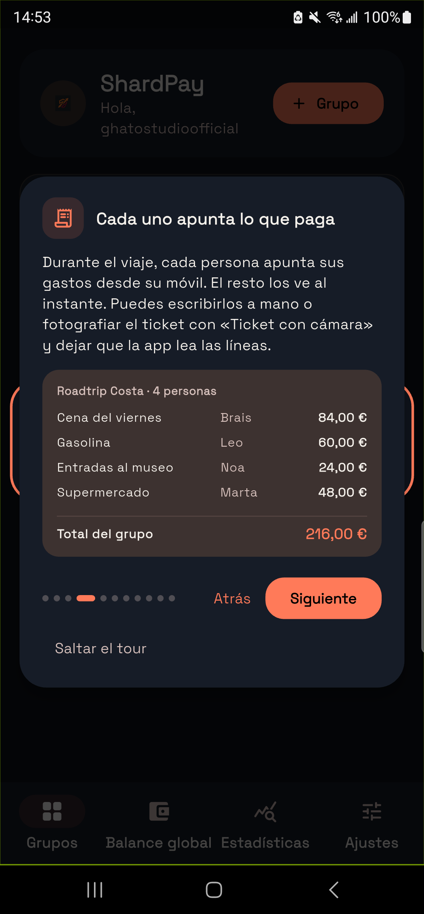

Cada grupo tiene un **enlace** y un **código QR**. Pulsa *Invitar* y compártelo
por donde quieras. Quien lo reciba entra directamente al grupo.

Si el grupo tiene personas apuntadas que aún no tenían cuenta, al entrar podrán
decir «yo soy Marta» y quedarse con esa identidad, con sus gastos ya contados.

---

## 2. Apuntar gastos

### A mano

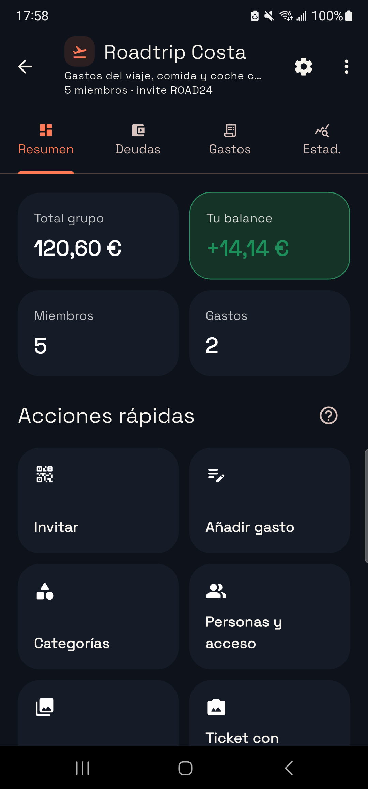
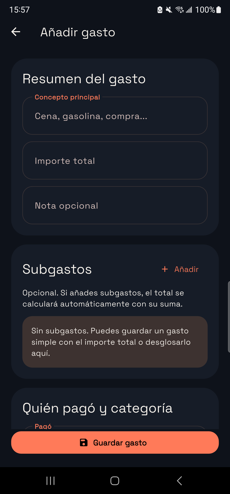

Pulsa **Añadir gasto** y rellena:

- **Concepto**: cena, gasolina, la compra…
- **Importe total**.
- **Quién pagó**.
- **Categoría**.
- **Quién participa**. Por defecto se reparte a partes iguales entre todos.

### Con la cámara: el lector de tickets

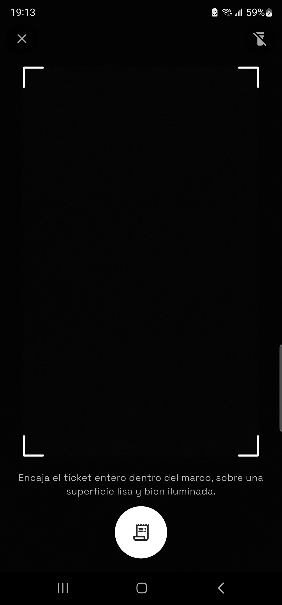

Esta es la parte que más tiempo ahorra. Pulsa **Ticket con cámara**.

#### Hacer la foto

Se abre una pantalla de captura con:

- Un **marco** que marca dónde poner el ticket.
- Una **linterna**, arriba a la derecha.
- **Enfoque al tocar**: toca la parte del ticket que quieras que salga nítida.

**Para que salga bien:**

1. **Estira el ticket** sobre una superficie lisa. Un ticket arrugado se lee
   mucho peor: las letras se deforman con los pliegues.
2. **Evita las sombras.** No hagas la foto con el móvil justo encima si eso
   proyecta sombra sobre el papel.
3. **Que quepa entero**, incluida la línea del TOTAL. La app la usa para
   comprobar que la suma cuadra.
4. **Si hay poca luz, enciende la linterna.** Es mejor eso que una foto oscura.

#### Recortar

Después de la foto puedes recortar y girar. Deja solo el ticket: cuanto menos
mantel y menos mesa, mejor.

#### Revisar

La app lee el ticket y te enseña lo que ha entendido. Arriba verás un resumen con
tres posibles estados:

| Lo que ves | Qué significa | Qué hacer |
| --- | --- | --- |
| **Ticket leído y cuadrado con su total** | La suma de las líneas coincide con el total impreso | Una ojeada rápida y guardar |
| **Ticket leído en parte** | Falta algo o sobra algo | Revisa las líneas una a una |
| **Casi no se ha podido leer** | La foto no daba para más | Repite con más luz |

Debajo verás el **total del ticket** y la **suma de líneas**, para poder
compararlos de un vistazo.

Cada línea se puede editar: nombre, importe, categoría y quién participa.

**La línea «Resto del ticket».** Cuando la app no consigue leer todos los
productos pero sí el total, añade una línea de ajuste con la diferencia. Está
ahí a propósito: es preferible que el grupo reparta lo que de verdad se pagó,
aunque una parte no tenga nombre, a que reparta una cifra que no es la del
ticket. Puedes renombrarla o repartirla como quieras.

---

## 3. Repartir

Por defecto, cada gasto se reparte a partes iguales entre quienes participan.

Para afinar, pulsa **Ajustar reparto** en una línea. Ahí puedes dar a cada
persona el porcentaje que le toque. La suma tiene que dar 100.

Esto se ajusta **línea a línea**, no por gasto entero. Así, en una cena, el vino
lo pueden pagar tres y el postre solo dos.

---

## 4. Saldos y liquidar

### Saldo del grupo

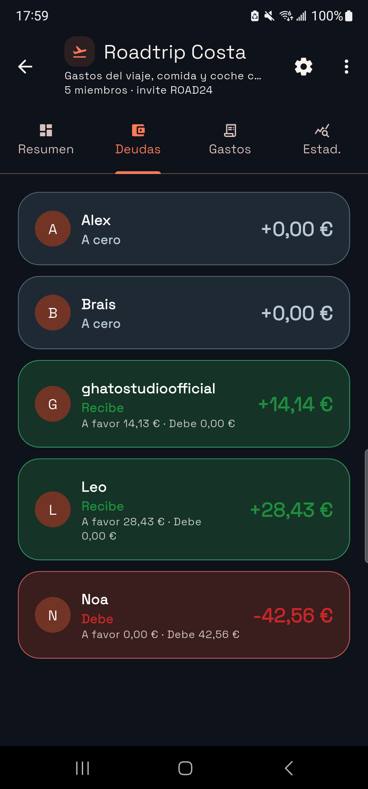

La pestaña **Balance** muestra cuánto debe o le deben a cada persona, y propone
el **mínimo número de pagos** que dejaría todo a cero. Si tocas a una persona,
se abre además el desglose de sus deudas directas, gasto a gasto.

Las dos listas no son la misma. Las deudas directas son las que salen de mirar
quién pagó qué; los pagos propuestos salen de cruzarlas antes de sugerir nada, y
casi siempre son bastantes menos. En el ejemplo de la sección siguiente, cinco
deudas se quedan en dos pagos sin que nadie gane ni pierda un céntimo.

### Saldo global

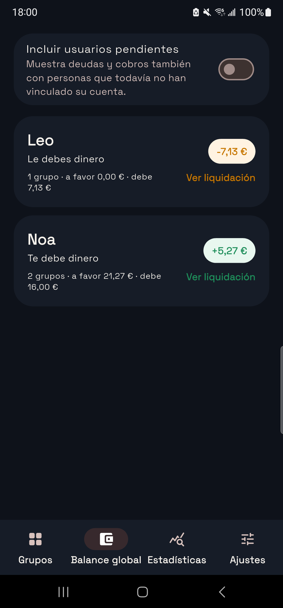

La pestaña **Saldo global** junta todos tus grupos: qué te debe cada persona
sumando todo, con el desglose por grupo.

### Registrar un pago

Cuando alguien te pague, pulsa **Reembolsar** y apunta el importe. La app lo
descuenta de las deudas más antiguas primero.

También puedes **pedir** un reembolso: le llega un aviso a la otra persona.

---

## 5. Un ejemplo de principio a fin

Todo lo anterior junto, con números que se pueden seguir de cabeza. Este mismo
ejemplo es el que sale en el tour guiado y en **Ajustes › Ayuda**, y las cuentas
que verás aquí no están escritas a mano: salen del propio motor de cálculo de la
app y hay una prueba automática que lo comprueba en cada cambio.

### El grupo

**Roadtrip Costa** — un fin de semana de cuatro personas: **Brais**, **Noa**,
**Leo** y **Marta**.

Brais crea el grupo, le pone el icono del avión, elige euros y comparte el
enlace de invitación por el chat del viaje. Las otras tres entran desde el
enlace y aparecen en la lista de miembros sin tener que teclear nada.

### Los gastos

Durante el fin de semana cada uno va pagando lo que le toca pagar, y lo apunta
en cuanto sale del sitio. **No hace falta que pague siempre el mismo**: eso es
justo lo que ShardPay está para arreglar.

| Concepto | Pagó | Importe | Se reparte entre | Le toca a cada uno |
| --- | --- | ---: | --- | ---: |
| Cena del viernes | Brais | 84,00 € | los cuatro | 21,00 € |
| Gasolina | Leo | 60,00 € | los cuatro | 15,00 € |
| Entradas al museo | Noa | 24,00 € | Noa y Marta | 12,00 € |
| Supermercado | Marta | 48,00 € | los cuatro | 12,00 € |
| **Total** | | **216,00 €** | | |

Fíjate en la tercera línea. Al museo fueron solo Noa y Marta, así que en esa
línea se abre **Ajustar reparto** y se dejan fuera a Brais y a Leo. Ni uno ni
otro pagan un céntimo de esas entradas. El reparto se ajusta **línea a línea**,
no por gasto entero: si en la cena el vino lo comparten tres y el postre dos, se
apunta la cena como dos líneas y cada una con su reparto.

El supermercado se apuntó con la cámara: Marta le hizo una foto al ticket, la
app leyó las líneas y ella solo tuvo que confirmar el total.

### Los saldos

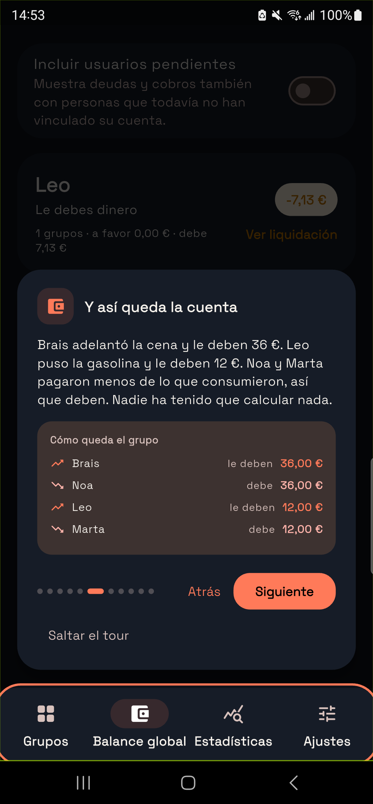

Con esos cuatro gastos, la pestaña **Balance** enseña esto:

| Persona | Puso | Le correspondía | Saldo |
| --- | ---: | ---: | ---: |
| Brais | 84,00 € | 48,00 € | **+36,00 €** |
| Leo | 60,00 € | 48,00 € | **+12,00 €** |
| Marta | 48,00 € | 60,00 € | **−12,00 €** |
| Noa | 24,00 € | 60,00 € | **−36,00 €** |

En verde y con signo positivo, lo que a esa persona **le deben**. En rojo y con
signo negativo, lo que **debe**. La columna de saldos siempre suma cero; si no
sumara, sería un error de la app.

Marta es el caso que más se malinterpreta: puso 48 €, que no es poco, y aun así
debe dinero. Es porque participa en todo, incluido el museo, y le corresponden
60 €. **Poner mucho no es lo mismo que tener saldo a favor.**

### Quién le debe a quién

Si tocas el nombre de una persona en **Balance**, ShardPay abre el desglose de
sus deudas directas: gasto a gasto, quién le debe qué a quién. En este grupo
salen cinco:

| Debe | A | Cuánto |
| --- | --- | ---: |
| Noa | Brais | 21,00 € |
| Marta | Brais | 9,00 € |
| Leo | Brais | 6,00 € |
| Noa | Leo | 15,00 € |
| Marta | Leo | 3,00 € |

Noa y Marta no aparecen juntas en ninguna fila, y no es un olvido: Marta le debe
12 € a Noa por el museo, y Noa le debe otros 12 € a Marta por su parte del
supermercado. Se cruzan y quedan a cero entre ellas.

### Liquidar

Cinco transferencias para saldar un fin de semana son muchas. Al pulsar
**Liquidar**, la app cruza todas las deudas y propone el **mínimo número de
pagos** que deja el grupo a cero:

| Paga | A | Cuánto |
| --- | --- | ---: |
| Noa | Brais | 36,00 € |
| Marta | Leo | 12,00 € |

**Dos pagos en vez de cinco**, y 48 € moviéndose en vez de 54 €. Nadie pierde ni
gana un céntimo: Brais recupera exactamente sus 36 €, Leo sus 12 €, y Noa y
Marta pagan exactamente lo que debían. Lo único que cambia es a quién se lo
transfieren.

Cuando Noa haga la transferencia, Brais pulsa **Reembolsar** en la ficha de Noa
y apunta los 36 €. Esa deuda desaparece del grupo. Si Brais prefiere que se lo
recuerden a él, puede **pedir** el reembolso y a Noa le llega un aviso.

### Las estadísticas

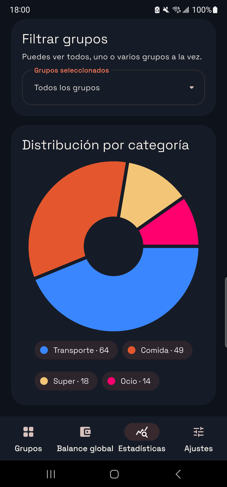
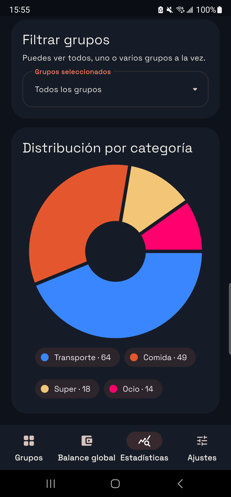

La pestaña **Estadísticas** responde a la otra pregunta del viaje, la de «¿en
qué se nos ha ido el dinero?». Para este grupo:

| Categoría | Gasto | Del total |
| --- | ---: | ---: |
| Comida | 84,00 € | 38,9 % |
| Transporte | 60,00 € | 27,8 % |
| Compra | 48,00 € | 22,2 % |
| Ocio | 24,00 € | 11,1 % |

Y quién puso el dinero, que es una pregunta distinta de quién lo debe:

| Persona | Puso | Del total |
| --- | ---: | ---: |
| Brais | 84,00 € | 38,9 % |
| Leo | 60,00 € | 27,8 % |
| Marta | 48,00 € | 22,2 % |
| Noa | 24,00 € | 11,1 % |

216 € entre cuatro personas y dos días salen a **54 € por persona**. Las
categorías salen de las que se eligen al apuntar cada gasto, así que si quieres
un desglose útil, vale la pena marcarlas bien.

> Si tienes varios grupos abiertos, **Saldo global** hace esta misma suma con
> todos a la vez: cuánto te debe cada persona en total, con el desglose por
> grupo. Es lo que quieres mirar cuando compartes piso con alguien con quien
> además te vas de viaje.

---

## 6. Ajustes

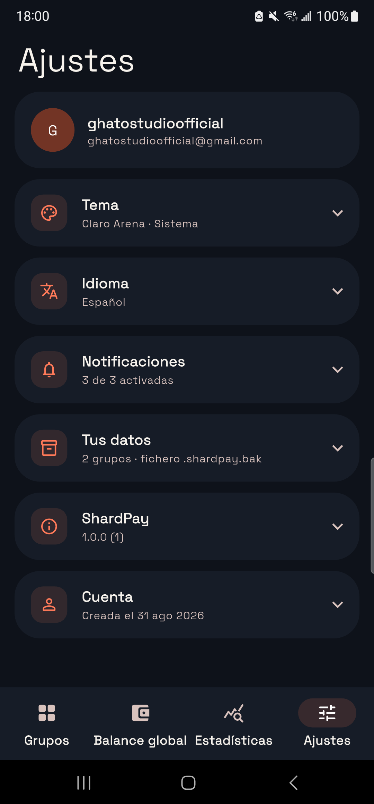

Todo lo que se puede configurar está en **Ajustes**.

Las secciones vienen plegadas y cada una enseña su valor actual en el
encabezado, así que muchas veces no hace falta ni abrirlas.

### Tema

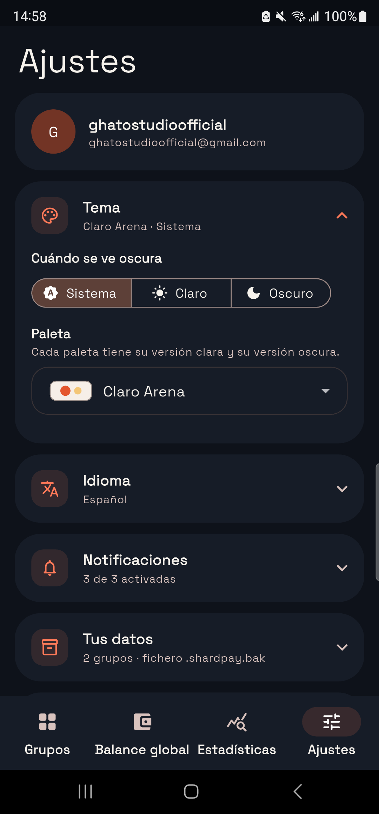
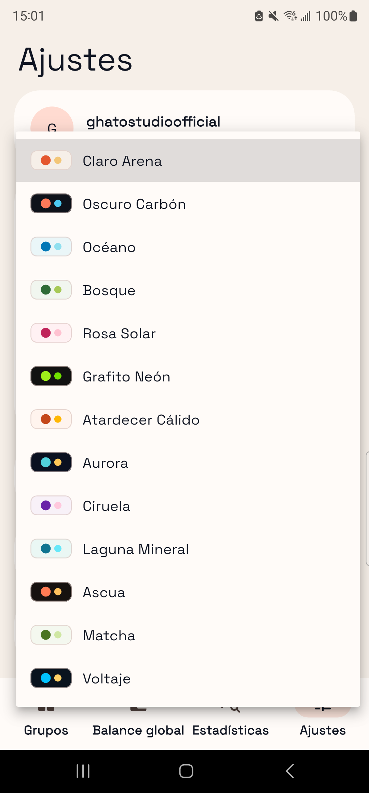

Dos cosas por separado:

- **Modo**: *Sistema* (sigue al móvil), *Claro* o *Oscuro*.
- **Paleta**: trece estéticas. Cada una tiene su versión clara y su versión
  oscura, así que si eliges *Océano* y el móvil pasa a oscuro, la app se pone
  *Aurora*, que es la misma idea en oscuro.

El cambio es inmediato y se recuerda.

### Idioma

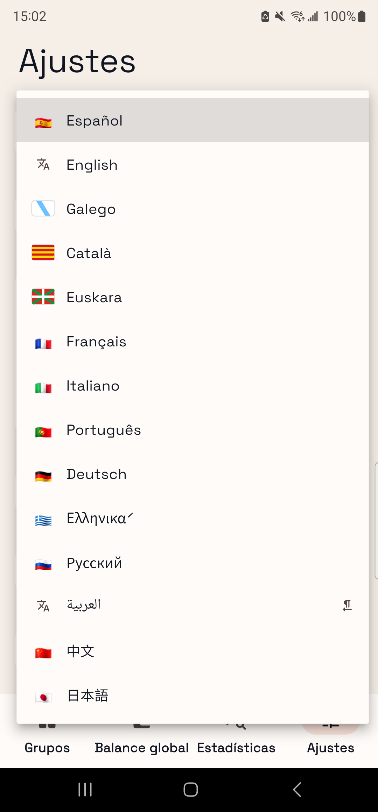
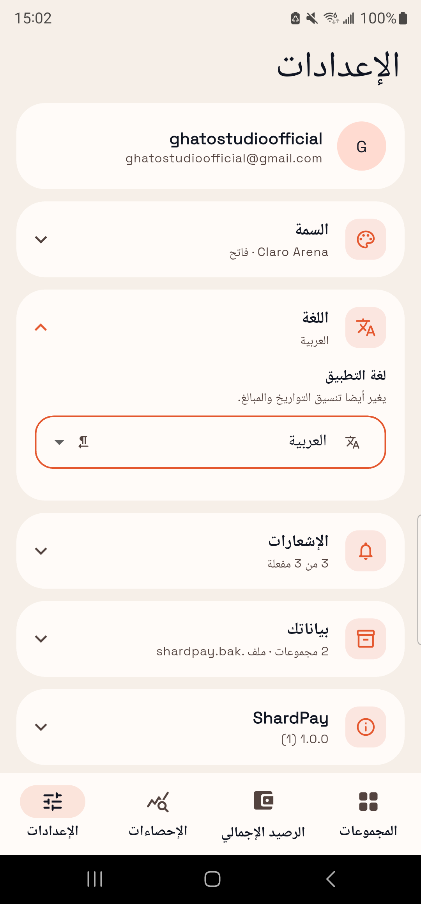

Catorce idiomas, cada uno escrito en su propio idioma. El árabe se muestra de
derecha a izquierda, con toda la interfaz reflejada.

### Notificaciones

Tres avisos que se encienden y se apagan por separado: gastos nuevos, reembolsos
registrados y solicitudes de reembolso.

### Tus datos

**Exportar mis datos** guarda todo —tus grupos, sus gastos y tus ajustes— en un
fichero `.shardpay.bak` que puedes mandarte por correo o guardar donde quieras.

**Importar una copia** te deja recuperarlo. Antes de tocar nada:

1. La app comprueba que el fichero es válido. Si está dañado, te avisa **antes**
   de cambiar nada.
2. Guarda una copia automática de cómo estaban las cosas.
3. Te pregunta qué quieres restaurar:
   - **Solo ajustes** — tema, idioma y notificaciones.
   - **Ajustes y grupos** — lo anterior, más los grupos de la copia que ya no
     tengas.

**Los grupos que todavía existen no se tocan.** Pueden tener gastos que otras
personas hayan añadido después de hacerse la copia, y restaurarlos encima los
borraría.

> El fichero `.shardpay.bak` **no va cifrado**. Es un fichero tuyo, en tu
> dispositivo. Si contiene información que no quieres que vea nadie, guárdalo en
> un sitio protegido.

### Compartir, ayuda y acerca de

- **Ver el tour guiado** repite el repaso de la primera vez.
- **Ayuda** es la versión larga de esto que estás leyendo.
- **Compartir ShardPay**, en un botón a todo el ancho, manda el enlace de la app.
- **Acerca de** dice qué versión tienes exactamente. Es lo primero que hay que
  mirar si algo falla.

### Invítame a un café

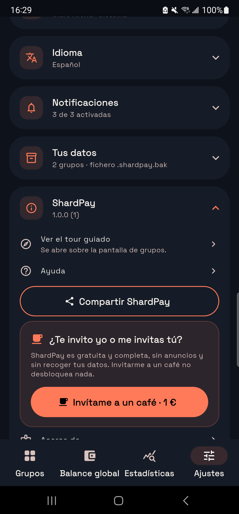
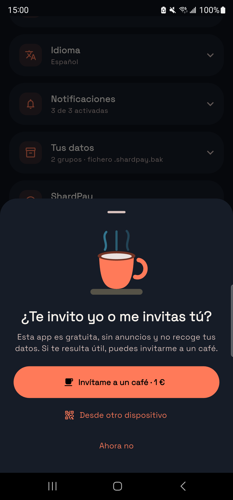

En **Ajustes › ShardPay** hay un botón, «Invítame a un café · 1 €», que abre un
panel con el enlace de pago y un código QR para hacerlo desde otro dispositivo.

**No desbloquea nada.** Ni funciones, ni temas, ni nada. La app que tienes ya es
la completa. Si invitas, lo único que cambia es que el aviso deja de salir.

---

## 7. Si algo falla

1. **Cierra la app del todo y vuelve a abrirla.** Arregla más cosas de las que
   parece.
2. **Mira la versión** en Ajustes → Acerca de.
3. **Exporta una copia de tus datos** antes de tocar nada más.
4. **Cuéntalo** en <https://github.com/braisgaldo/shardpay/issues>, con la
   versión, qué esperabas y qué pasó.

Si el problema es de lectura de tickets, **adjunta el ticket** si puedes. Es lo
que más ayuda a arreglarlo.

### Problemas concretos

**«El lector no reconoce nada.»** Casi siempre es la foto. Repite con el ticket
estirado, buena luz y sin sombras. Si el ticket es de tinta térmica muy gastada,
puede que no haya nada que hacer: mete el gasto a mano.

**«Los importes salen mal.»** Revisa que el separador decimal del ticket sea
claro. Puedes corregir cada importe antes de guardar.

**«No me llegan las notificaciones.»** Comprueba que están activadas en Ajustes
y que Android tiene permiso concedido para la app.

**«No veo un grupo al que me invitaron.»** Comprueba que has entrado con la misma
cuenta con la que aceptaste la invitación.

---

## 8. Privacidad, en corto

- Las fotos de los tickets **se leen en tu móvil**. No se envían a ningún
  servicio de terceros para reconocer el texto.
- Los datos de un grupo los ven **los miembros de ese grupo**, nadie más.
- **No hay analítica ni telemetría.**
- La política completa está en
  <https://braisgaldo.github.io/shardpay/privacidad.html>.
